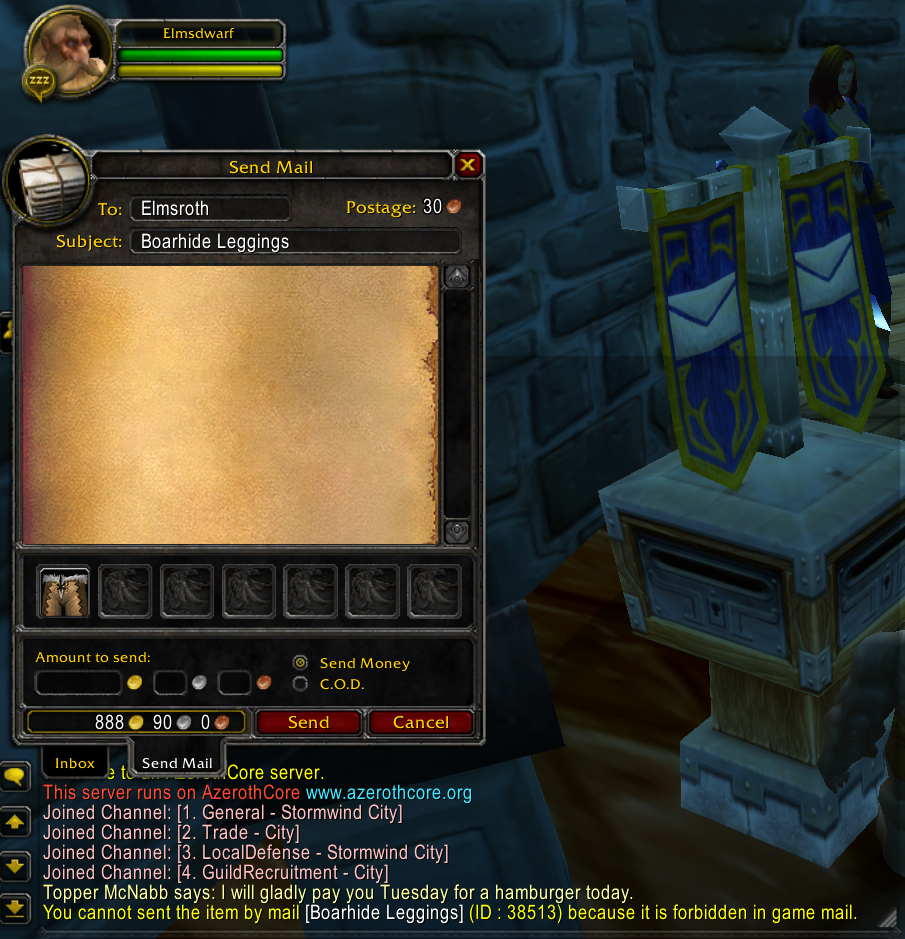
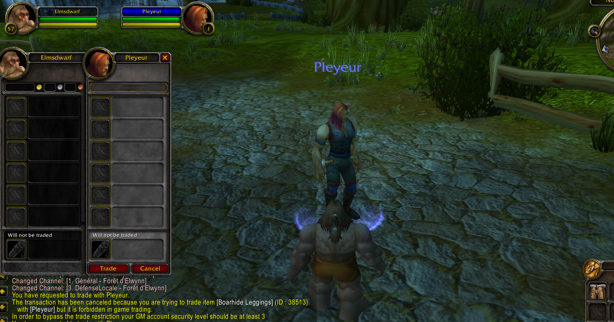
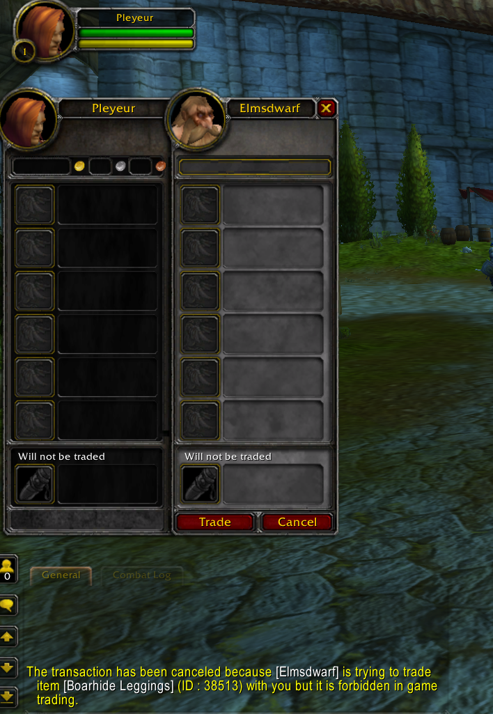

# mod-trade-items-filter AzerothCore Custom Module

This modules allow you to filter items in game that are allowed to be traded and sent by mail.

See [config file](../conf/mod-trade-items-filter.conf.dist) for customizable options.

This modules uses `CanSetTradeItem` & `CanSendMail` hooks.

## Mail items filtering preview

## Trade items filtering preview

From a GM who have a low security level and who cannot bypass the `ModTradeItemsFilter.GameMasters.MinAccountSecurityLevelToByPassForbiddenItems` restriction :

From a player point of view :

## Licensing

MIT License
